# 长沙大学生兼职平台 — 数据库ER图

```mermaid
erDiagram
    %% ========== 模块1: 用户与身份体系 ==========
    
    t_school ||--o{ t_student : "school_id"
    
    t_student {
        bigint id PK "主键"
        varchar user_id UK "用户唯一标识(UUID)"
        varchar openid "小程序OpenID"
        varchar real_name "真实姓名"
        tinyint gender "0未知/1男/2女"
        bigint school_id FK "所属高校ID"
        varchar student_no "学号"
        tinyint verify_status "0未核验/1核验中/2核验通过/3核验失败"
        varchar id_card_encrypt "身份证号(AES加密)"
        varchar phone_encrypt "手机号(AES加密)"
        json available_time "可工作时间(JSON)"
        varchar skill_tags "技能标签"
        int credit_score "信用分(0-200)"
        tinyint is_deleted "逻辑删除"
        datetime create_time "创建时间"
        datetime update_time "更新时间"
    }
    
    t_enterprise {
        bigint id PK "主键"
        varchar enterprise_id UK "企业唯一标识(UUID)"
        varchar enterprise_name "企业名称"
        varchar credit_code "统一社会信用代码"
        varchar business_license_url "营业执照OSS地址"
        tinyint verify_status "0未提交/1审核中/2通过/3失败/4黑名单"
        varchar legal_person "法人姓名"
        varchar contact_name "联系人姓名"
        varchar contact_phone_encrypt "联系人手机号(AES加密)"
        varchar industry_tag "行业标签"
        int credit_score "企业信用分(0-200)"
        tinyint is_certified "0否/1是"
        tinyint is_deleted "逻辑删除"
        datetime create_time "创建时间"
        datetime update_time "更新时间"
    }
    
    t_school {
        bigint id PK "主键"
        varchar school_name "高校名称"
        varchar address "高校地址"
        int student_count "在校生人数"
    }
    
    t_admin {
        bigint id PK "主键"
        varchar admin_id UK "管理员唯一标识(UUID)"
        varchar username UK "登录用户名"
        varchar password_encrypt "密码(BCrypt加密)"
        varchar real_name "真实姓名"
        tinyint role_type "1审核/2风控/3运营/4财务/5超级"
        tinyint status "0停用/1正常"
        tinyint is_deleted "逻辑删除"
        datetime create_time "创建时间"
        datetime update_time "更新时间"
    }
    
    %% ========== 模块2: 岗位与匹配体系 ==========
    
    t_enterprise ||--o{ t_job : "enterprise_id"
    
    t_job ||--o{ t_job_apply : "job_id"
    t_student ||--o{ t_job_apply : "student_id"
    
    t_student ||--o{ t_job_match_log : "student_id"
    t_job ||--o{ t_job_match_log : "job_id"
    
    t_job {
        bigint id PK "主键"
        varchar job_id UK "岗位唯一标识(UUID)"
        varchar enterprise_id FK "发布企业ID"
        varchar job_title "岗位名称"
        varchar job_type "岗位类型"
        varchar industry_tag "行业标签"
        tinyint salary_type "1时薪/2日薪/3周薪"
        decimal salary_amount "薪资标准"
        tinyint settlement_type "1日结/2周结/3月结"
        varchar work_address "工作地址"
        decimal longitude "经度"
        decimal latitude "纬度"
        json work_time "工作时间要求(JSON)"
        varchar skill_require "技能要求"
        text job_desc "岗位描述"
        int recruit_num "招聘人数"
        int current_num "已录用人数"
        tinyint status "0待审核/1已发布/2已下架/3已结束"
        tinyint is_insured "0否/1是(含意外险)"
        tinyint is_deleted "逻辑删除"
        datetime create_time "创建时间"
        datetime update_time "更新时间"
    }
    
    t_job_apply {
        bigint id PK "主键"
        varchar apply_id UK "投递唯一标识(UUID)"
        varchar job_id FK "岗位ID"
        varchar student_id FK "学生ID"
        tinyint apply_status "0已投递/1待面试/2已录用/3已拒绝/4已取消"
        datetime interview_time "面试时间"
        tinyint is_deleted "逻辑删除"
        datetime create_time "创建时间"
        datetime update_time "更新时间"
    }
    
    t_job_match_log {
        bigint id PK "主键"
        varchar student_id FK "学生ID"
        varchar job_id FK "岗位ID"
        decimal match_score "匹配得分"
        tinyint is_recommend "是否推送推荐"
        datetime create_time "创建时间"
    }
    
    %% ========== 模块3: 薪资与结算体系 ==========
    
    t_job ||--o{ t_electronic_agreement : "job_id"
    t_student ||--o{ t_electronic_agreement : "student_id"
    t_enterprise ||--o{ t_electronic_agreement : "enterprise_id"
    
    t_enterprise ||--o{ t_salary_escrow : "enterprise_id"
    t_job ||--o{ t_salary_escrow : "job_id"
    
    t_student ||--o{ t_salary_flow : "student_id"
    t_enterprise ||--o{ t_salary_flow : "enterprise_id"
    t_job ||--o{ t_salary_flow : "job_id"
    t_electronic_agreement ||--o{ t_salary_flow : "agreement_id"
    
    t_student ||--o{ t_clock_record : "student_id"
    t_job ||--o{ t_clock_record : "job_id"
    
    t_electronic_agreement {
        bigint id PK "主键"
        varchar agreement_id UK "协议唯一标识(UUID)"
        varchar job_id FK "岗位ID"
        varchar student_id FK "学生ID"
        varchar enterprise_id FK "企业ID"
        text agreement_content "协议内容"
        varchar agreement_url "协议PDF OSS地址"
        tinyint sign_status "0待学生签署/1待企业签署/2已签署/3已作废"
        datetime sign_time "签署完成时间"
        varchar blockchain_hash "区块链存证哈希"
        tinyint is_deleted "逻辑删除"
        datetime create_time "创建时间"
        datetime update_time "更新时间"
    }
    
    t_salary_escrow {
        bigint id PK "主键"
        varchar escrow_id UK "托管单唯一标识(UUID)"
        varchar enterprise_id FK "企业ID"
        varchar job_id FK "岗位ID"
        decimal total_amount "托管总金额"
        decimal paid_amount "已发放金额"
        decimal freeze_amount "冻结金额"
        tinyint status "0待支付/1已托管/2已结清/3已退款"
        tinyint is_deleted "逻辑删除"
        datetime create_time "创建时间"
        datetime update_time "更新时间"
    }
    
    t_salary_flow {
        bigint id PK "主键"
        varchar flow_id UK "流水唯一标识(UUID)"
        varchar student_id FK "学生ID"
        varchar enterprise_id FK "企业ID"
        varchar job_id FK "岗位ID"
        varchar agreement_id FK "关联协议ID"
        decimal work_hours "工时"
        decimal salary_amount "应发薪资"
        decimal actual_amount "实发薪资(扣税后)"
        decimal tax_amount "代扣个税"
        tinyint settlement_status "0待确认/1待企业确认/2待发放/3已到账/4已驳回"
        datetime pay_time "到账时间"
        varchar trace_id "链路追踪ID"
        varchar invoice_id "关联发票ID"
        tinyint is_deleted "逻辑删除"
        datetime create_time "创建时间"
        datetime update_time "更新时间"
    }
    
    t_clock_record {
        bigint id PK "主键"
        varchar record_id UK "记录唯一标识(UUID)"
        varchar student_id FK "学生ID"
        varchar job_id FK "岗位ID"
        tinyint clock_type "1签到/2签退"
        datetime clock_time "打卡时间"
        decimal clock_longitude "打卡经度"
        decimal clock_latitude "打卡纬度"
        tinyint is_abnormal "0正常/1异常"
        datetime create_time "创建时间"
    }
    
    %% ========== 模块4: 安全与增值服务 ==========
    
    t_job ||--o{ t_complaint : "job_id"
    t_admin ||--o{ t_complaint : "handler_id"
    
    t_student ||--o{ t_insurance : "student_id"
    t_job ||--o{ t_insurance : "job_id"
    t_enterprise ||--o{ t_insurance : "enterprise_id"
    
    t_student ||--o{ t_practice_report : "student_id"
    t_job ||--o{ t_practice_report : "job_id"
    t_enterprise ||--o{ t_practice_report : "enterprise_id"
    
    t_complaint {
        bigint id PK "主键"
        varchar complaint_id UK "投诉唯一标识(UUID)"
        varchar complainant_id "投诉人ID"
        tinyint complainant_type "1学生/2企业"
        varchar defendant_id "被投诉人ID"
        tinyint defendant_type "1学生/2企业"
        varchar job_id FK "关联岗位ID"
        tinyint complaint_type "1虚假招聘/2薪资拖欠/3押金诈骗/4未履约/5信息泄露"
        text complaint_content "投诉内容"
        varchar evidence_urls "证据OSS地址(JSON数组)"
        tinyint status "0待审核/1处理中/2已调解/3已结案"
        varchar handler_id FK "处理人ID"
        text handle_result "处理结果"
        tinyint is_deleted "逻辑删除"
        datetime create_time "创建时间"
        datetime update_time "更新时间"
    }
    
    t_insurance {
        bigint id PK "主键"
        varchar insurance_id UK "保险唯一标识(UUID)"
        varchar student_id FK "学生ID"
        varchar job_id FK "岗位ID"
        varchar enterprise_id FK "投保企业ID"
        varchar insurance_type "保险类型"
        datetime start_time "生效时间"
        datetime end_time "结束时间"
        decimal premium "保费"
        tinyint status "0待生效/1生效中/2已过期/3已理赔"
        datetime create_time "创建时间"
    }
    
    t_practice_report {
        bigint id PK "主键"
        varchar report_id UK "报告唯一标识(UUID)"
        varchar student_id FK "学生ID"
        varchar job_id FK "岗位ID"
        varchar enterprise_id FK "企业ID"
        text work_content "工作内容"
        int work_duration "工作时长(小时)"
        text enterprise_comment "企业评价"
        varchar report_url "报告OSS地址"
        tinyint is_deleted "逻辑删除"
        datetime create_time "创建时间"
    }
    
    %% ========== 通用: 操作审计日志 ==========
    
    t_audit_log {
        bigint id PK "主键"
        varchar operator_id "操作人ID"
        tinyint operator_role "操作人角色"
        varchar module "操作模块"
        varchar action "操作类型"
        text request_params "请求参数(脱敏后)"
        varchar ip_address "操作IP"
        varchar client_type "端类型"
        varchar trace_id "链路追踪ID"
        datetime create_time "创建时间"
    }
```



---

## ER图说明

### 实体关系总览

| 模块 | 实体数 | 主要关系 |
|------|--------|----------|
| 用户与身份体系 | 4 | 学生→学校(N:1) |
| 岗位与匹配体系 | 3 | 企业→岗位(N:1), 学生↔岗位(投递/匹配) |
| 薪资与结算体系 | 4 | 岗位→协议→流水(链式关联), 学生→打卡记录(N:1) |
| 安全与增值服务 | 3 | 投诉(多角色关联), 保险/报告(学生-岗位-企业三方关联) |
| 通用审计日志 | 1 | 记录所有操作 |

### 核心业务流程数据链路

```
学生注册 → 岗位浏览 → 投递岗位 → 面试签约 → GPS打卡 → 工时确认 → 薪资结算 → 评价反馈
  ↑          ↑          ↑          ↑          ↑          ↑          ↑          ↑
t_student  t_job    t_job_apply t_electronic_  t_clock   t_salary   t_salary   t_complaint
                      agreement  record         flow      flow
```

### 五流合一关联字段

| 数据流类型 | 关联字段 | 对应表 |
|-----------|----------|--------|
| 合同流 | agreement_id | t_electronic_agreement |
| 资金流 | flow_id | t_salary_flow |
| 发票流 | invoice_id | t_salary_flow |
| 业务流 | job_id | t_job |
| 数据流 | trace_id | t_salary_flow, t_audit_log |

### 安全设计要点

1. **敏感字段加密**: 身份证号(id_card_encrypt)、手机号(phone_encrypt)、密码(password_encrypt)均加密存储
2. **逻辑删除**: 所有业务表均包含is_deleted字段，支持软删除
3. **审计日志**: t_audit_log记录所有操作，保留3年以上
4. **权限隔离**: 通过admin_role_type区分5类管理员权限